# TextMining-team6

## Analysis of Differences in Corporate Sustainability Reports Based on ESG Ratings
Team members: 
- Yunyoung choi (Life Science & AI)
- Nahee Park (Management & AI)
- Seojin Lee (Management & AI)
  
---

### Data
```
...
├── esg_grade_analysis
│   ├── esg_data_EDA.ipynb
│   └── esg_grade_data.csv
│
├── preprocessed_RData
│   ├── apple.RData
│   ├── dell.RData
│   ├── dtm.RData
│   └── microsoft.RData
│
└── sustainability_report
    ├── apple-2022.pdf
    ├── dell-2022.pdf
    └── microsoft-2022.pdf
```
  
     

1. `esg_grade_analysis/esg_grade_data.csv`   
   - ESG ratings and scores by company 

2. `preprocessed_RData/`  
   - `apple.RData`: Preprocessed data from Apple's 2022 sustainability report
   - `dell.RData`: Preprocessed data from Dell's 2022 sustainability report
   - `microsoft.RData`: Preprocessed data from Microsoft's 2022 sustainability report

   - `dtm.RData`: Document Term Matrix used for TF-IDF, topic modeling, text similarity, and word cloud analyses
     - Each document corresponds to one company (Apple, Dell, Microsoft):  total 3 documents.

3. `sustainability_report/`  
   - apple-2022.pdf: [Apple 2022 sustainability report](https://www.apple.com/pl/environment/pdf/Apple_Environmental_Progress_Report_2022.pdf)  

   - dell-2022.pdf: [Dell 2022 sustainability report](https://www.dell.com/en-us/dt/corporate/social-impact/esg-resources/reports.htm#tab0=0&pdf-overlay=//www.delltechnologies.com/asset/en-us/solutions/business-solutions/briefs-summaries/delltechnologies-fy22-esg-report.pdf)  

   - microsoft-2022.pdf: [Microsoft 2022 sustainability report](https://news.microsoft.com/wp-content/uploads/prod/sites/42/2023/05/2022-Environmental-Sustainability-Report.pdf)   


### Code
#### Files
```
├ ...
├── 01_data_preprocessing.R
├── 02_ngram_analysis.R
├── 03_TF-IDF.R
├── 04_topic_modeling.R
├── 05_word_cloud.R
├── 06_text_similarity.R
```

#### Results
<h5>n-gram analysis</h5>
<ul>
  <li>Microsoft</li>
  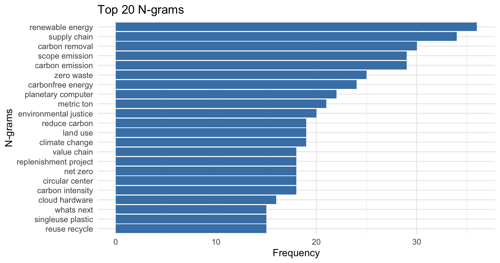
  <li>Dell</li>
  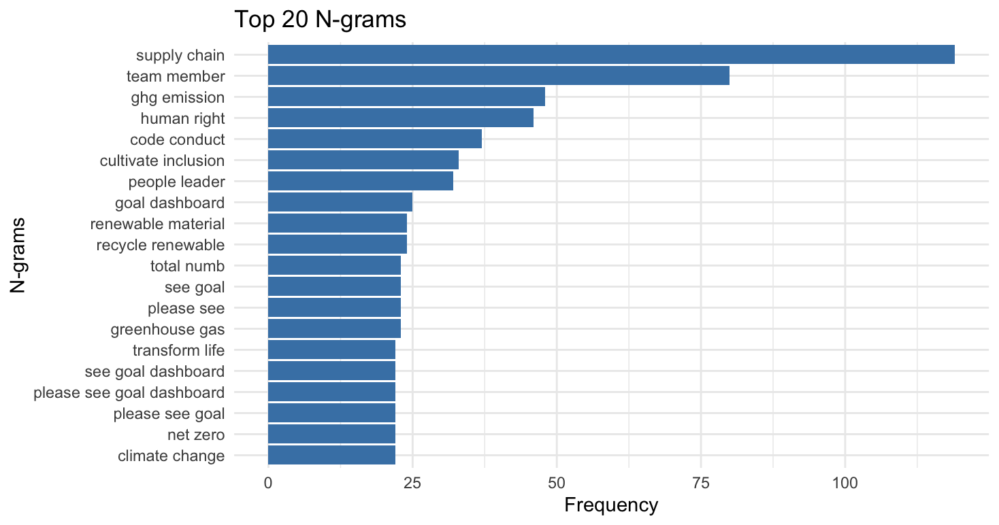
  <li>Apple</li>
  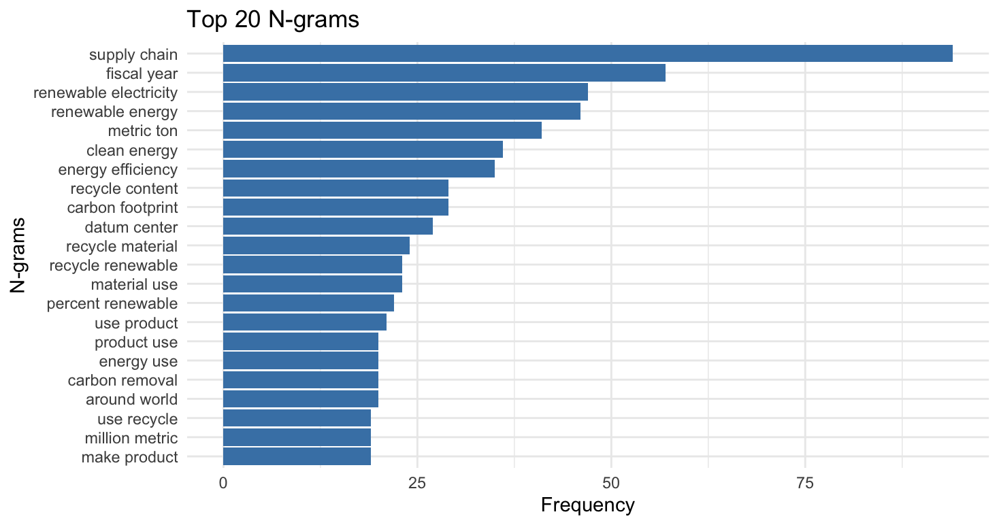
</ul>

<h5>TF-IDF</h5>
<ul>
  <li>Microsoft</li>
  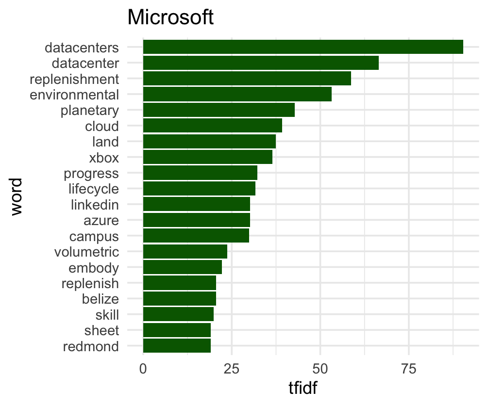
  <li>Dell</li>
  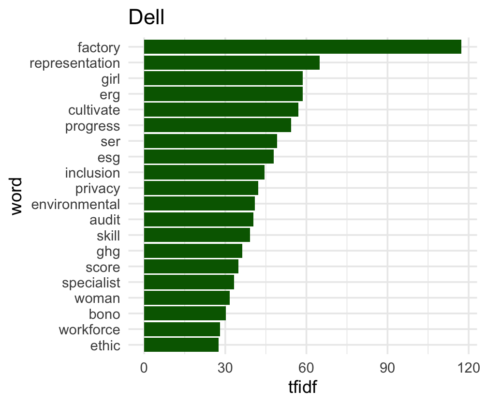
  <li>Apple</li>
  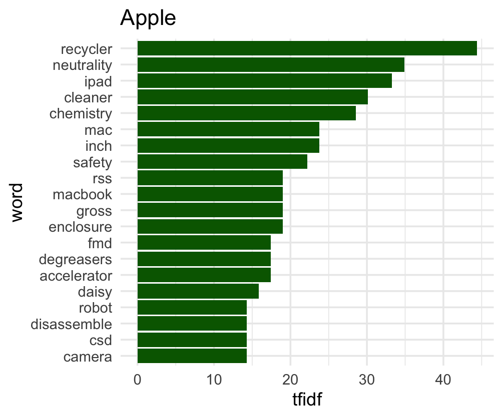
</ul>

<h5>Topic Modeling</h5>
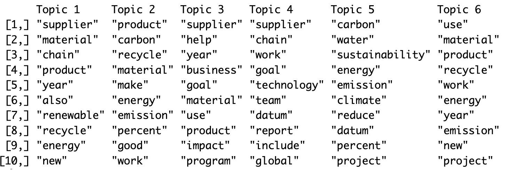

<h5>Word Cloud</h5>
<ul>
  <li>Microsoft</li>
  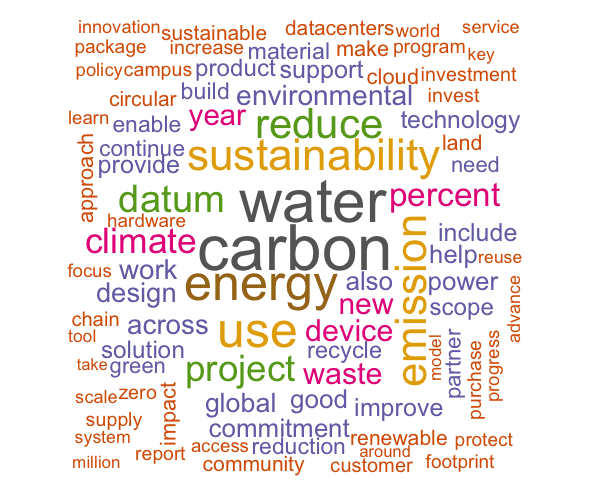
  <li>Dell</li>
  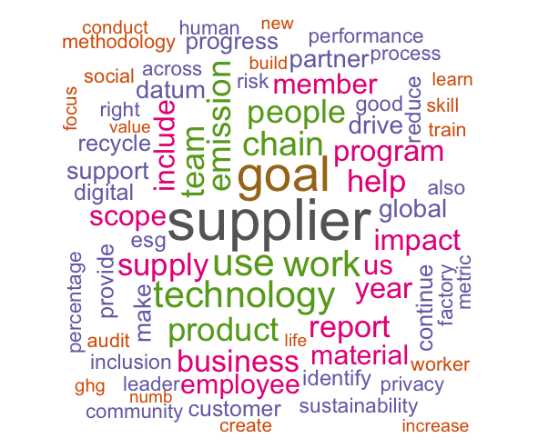
  <li>Apple</li>
  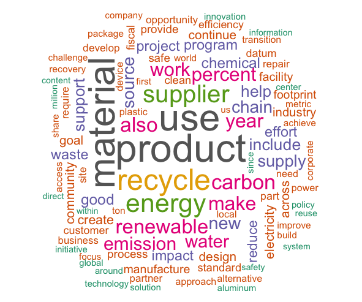
</ul>

<h5>Text Similarity</h5>
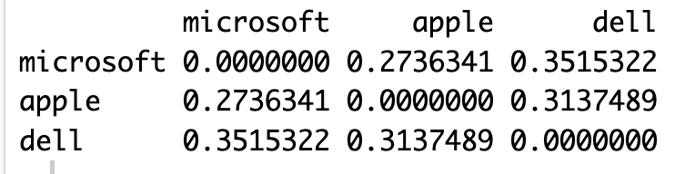


#### Required Packages
```
library(pdftools)
library(dplyr)
library(stringr)
library(tm)
library(stopwords)
library(textstem)
library(ldatuning)
library(topicmodels)
library(tidytext)
library(wordcloud)
```
